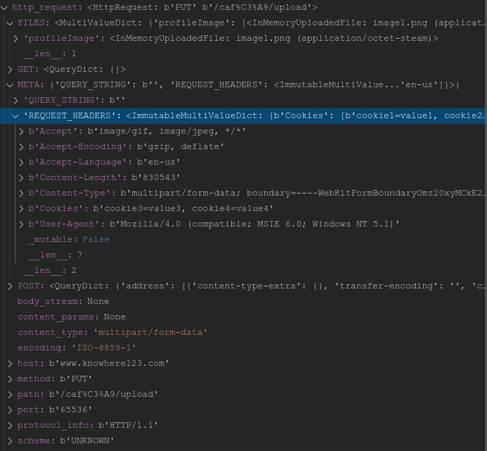

# request_parser
request_parser is an HTTP request parsing library in Python.  
request_parser provides an easy API to access information in HTTP requests.  
Travis status: [](https://travis-ci.org/wrvenkat/request_parser)
## Getting Started
### Dependencies
Requires [six](https://pypi.org/project/six/) and [future](https://pypi.org/project/future/). These can be installed as below.
```bash
pip install six
pip install future
```
## Example
To use the library, `git clone` the repository and copy the library directory `request_parser` to a location that is present in [PYTHONPATH](https://docs.python.org/2/using/cmdline.html#envvar-PYTHONPATH) or copy somewhere and add that location to `PYTHONPATH`.

Once the library is setup, it can be used as shown below.
```python
from request_parser.http.request import HttpRequest
from io import BytesIO

def parse_request_example(request=None):
    if request is None:
        return
    
    # create an iterable object out of request bytes
    request_stream = BytesIO(request)
    # create an HttpRequest object for the request
    http_request = HttpRequest(request_stream=request_stream)

    # parse request header
    http_request.parse_request_header()
    # parse request body
    http_request.parse_request_body()

    # do stuff with parsed information from the HttpRequest object
    print "This is a request to: "+http_request.get_host()
```
It is also possible to use the `parse()` method of `HttpRequest` object to parse the request header and the body in a single call.

Following picture shows how the infromation contained in an `HttpRequest` object looks like after successfully parsing a `multipart/form-data` request.  



For more documentation, please see the [wiki](https://github.com/wrvenkat/request_parser/wiki).

### Miscellaneous
The master branch is compatible only with Python 2.7. The `python3` branch works with Python 3.5 and above.